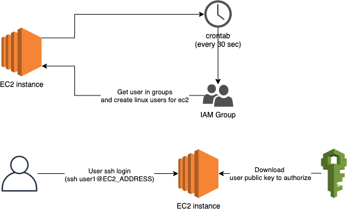

# terraform-kks-ec2-ssh-iamauth

Use aws-ec2-ssh (https://github.com/widdix/aws-ec2-ssh) to auto auth through IAM user public key.


## Overview

1. Crontab will execute command to sync users from groups every 30 seconds.
2. When user SSH login, will trigger to get the user public key to authorize.


## Pre-requirements
1. EC2 needs to open egress 80 & 443 port for package installation and AWS IAM access.
2. This module will disable AWS [ec2-instance-connect](https://docs.aws.amazon.com/AWSEC2/latest/UserGuide/Connect-using-EC2-Instance-Connect.html) feature. 


## Usage
```hcl
module "ec2_auth" {
  source                      = "git::https://gitlab.kkinternal.com/kkstream/tf_modules/terraform-kks-ec2-ssh-iamauth"
  ec2_role_id                 = "ec2-role"
  allow_login_iam_group_names = ["Developers"]
}

resource "aws_instance" "instance" {
  ami                         = "ami-0eeb679d57500a06c"
  instance_type               = "m5.large"
  vpc_security_group_ids      = var.security_group_ids
  subnet_id                   = var.subnet_id
  iam_instance_profile        = var.iam_instance_profile_name
  user_data_base64            = module.ec2_auth.ec2_user_data_base64
}
```


## Requirements

| Name | Version |
|------|---------|
| terraform | >= 0.13 |
| aws provider | >= 3.20 |

## Inputs

| Name | Description | Type | Default | Required |
|------|-------------|------|---------|----------|
| ec2_role_id | Give the EC2 role ID (role name) for attaching the additional permissions. | string | no | yes |
| allow_login_iam_group_names | Give the IAM group names for allowing group users login | list(string) | no | yes |


## Outputs

| Name | Description | Type |
|------|-------------|------|
| ec2_user_data | (Deprecated) User data for EC2 | string | 
| ec2_user_data_base64 | (Recommend) User data for EC2 in base64 | string | 
